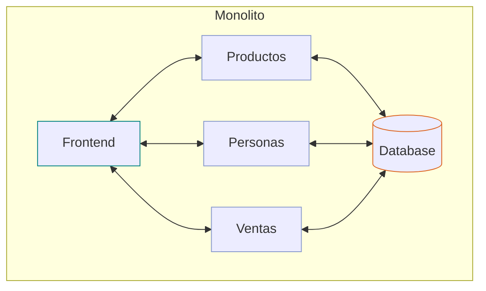
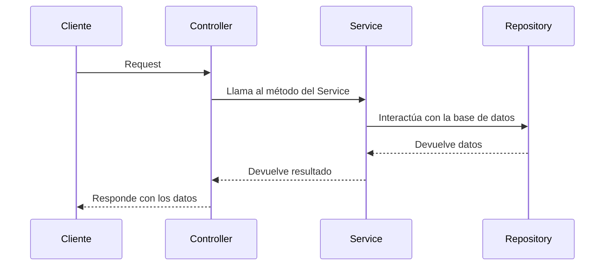

# Tienda102 - Fastify

## Monolito



- Incluye todos los servicios
- Incluye al frontend

```sh
npm install
npm test
npm run dev
```

## Hexagonal

- Un router invoca a controllers
- Un controller invoca services
- Un service invoca repositories y otros services
- Un repository usa models

- Los routers y controllers son parte de la interface web de usuario
- Puede haber equivalentes para interface de consola y otros
- Los repositories son parte de la interface de datos
- Los services contienen la business logic
- Los services idealmente son agnósticos a la interface de usuario y a la interface de datos



## Sockets

- Se hacen solicitudes esperando una respuesta inmediata con un id de referencia.
- Luego se recibirá la respuesta via sockets.

## curl

```sh
# get all productos
curl http://localhost:3000/api/productos

# create producto
curl -X POST http://localhost:3000/api/productos -H "Content-Type: application/json" -d '{"nombre": "Producto Nuevo", "precio": 15, "costo": 10, "cantidad": 10}'

# get producto
curl http://localhost:3000/api/productos/1

# update producto
curl -X PUT http://localhost:3000/api/productos/1 -H "Content-Type: application/json" -d '{"nombre": "Producto Actualizado", "precio": 20, "costo": 10, "cantidad": 5}'

curl -X PUT http://localhost:3000/api/productos/1 -H "Content-Type: application/json" -d '{"cantidad": 6}'

# delete producto
curl -X DELETE http://localhost:3000/api/productos/1


# get all personas
curl http://localhost:3000/api/personas

# create persona
curl -X POST http://localhost:3000/api/personas -H "Content-Type: application/json" -d '{"nombre": "Ana"}'

# get persona
curl http://localhost:3000/api/personas/1

# update persona
curl -X PUT http://localhost:3000/api/personas/1 -H "Content-Type: application/json" -d '{"nombre": "Betty"}'

# delete persona
curl -X DELETE http://localhost:3000/api/personas/1


# get all ventas
curl http://localhost:3000/api/ventas

# create venta
curl -X POST http://localhost:3000/api/ventas -H "Content-Type: application/json" -d '{"persona_id": 1, "producto_id": 1, "precio": 15, "cantidad": 1}'


```

## bash

```sh
# para poblar la base de datos
./populate-db-demo.sh

# para renombrar un grupo de archivos copiados
for file in producto*; do mv $file $(echo $file | sed 's/productos-/ventas-/'); done
```

## To Do

- Mejorar el testing
    - Cómo probar features aisladamente
    - Cómo probar capas aisladamente
- Implementar un CLI
- Implementar scaffolding
- Cómo sería implementar la tienda en Nest Fastify